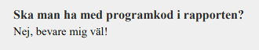

```{r setup, include=FALSE}
knitr::opts_chunk$set(echo = FALSE)
```

## Structure

- Introduction
- Methods
- Results
- Discussion
- References
- Appendices

## Introduction

- Why are we doing this?
- What have been done (literature review)?
- How will we approach the problem?

Start writing already now!

## Methods

What tools are we going to use:

- Statistical models and assumptions.
- How are we going to estimate parameters?
- Do we need numerical methods?

If there is a particular data-set in focus, the section becomes "Materials and Methods" and
includes a detailed description of data and data-collection.

## Results

Figures and tables from:

- Simulation study.
- Application to real data.

Some figures/tables will most likely be placed in appendix.

## Discussion

- What conclusions can we draw from results?
- Future directions for research.

This is the very last thing you write.

## References

- Cited literature.

Use `citation()` to get entries for R and packages

Use [Google scholar](https://scholar.google.se/) for articles and save it all in a `.bib`-file.

## Appendix

- Figures and tables that are not directly referenced in the text.
- Program code? Better to include a link to a GitHub repo.

From Exjobbs-FAQ (2004):



This advice is obsolete!