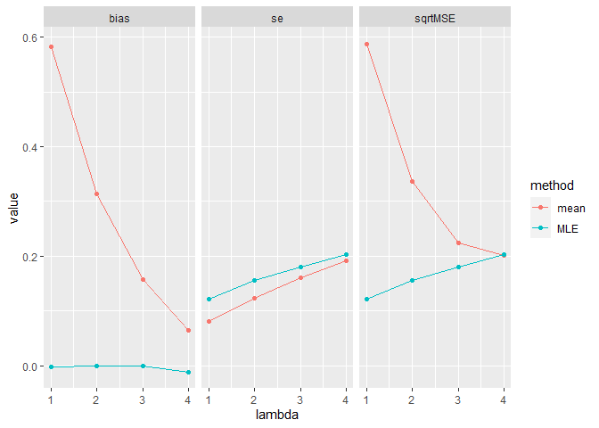

Simulation study
================

# Setup

``` r
library(tidyverse)
rztpois <- function(n, lambda){
  # Zero-truncated Poisson random draws
  assertthat::assert_that(length(lambda) == 1, msg = "Only works for scalar lambda")
  x <- numeric()
  while (length(x) < n) {
    x <- c(x, rpois(n, lambda))
    x <- x[x > 0]
  }
  x[1:n]
}
dztpois <- function(x, lambda){
  # Zero-truncated Poisson density
  dpois(x, lambda) / (1 - dpois(0, lambda))
}
fitztpois <- function(x){
  # Zero-truncated Poisson MLE
  fit <- optim(mean(x), function(lambda) -sum(log(dztpois(x, lambda))), 
               hessian = TRUE, method = "BFGS")
  list(estimate = fit$par,
       se = as.numeric(sqrt(1 / fit$hessian))
  )
}
```

# Simulations

``` r
set.seed(2022) # For reproducibility
# For each of 4 values of lambda, perform 1000 simulations of n = 100 observations
sim_study <- expand_grid(lambda = 1:4, n = 100, sim = 1:1000) %>% 
  rowwise() %>% 
  mutate(data = list(tibble(x = rztpois(n, lambda))), # Simulate data
         fit = list(fitztpois(data$x)), # Fit the MLE
         results = list(tibble( # Store the results
           method = c("MLE", "mean"),
           estimate = c(fit$estimate, mean(data$x))
         )))
sim_study
```

    ## # A tibble: 4,000 x 6
    ## # Rowwise: 
    ##    lambda     n   sim data               fit              results         
    ##     <int> <dbl> <int> <list>             <list>           <list>          
    ##  1      1   100     1 <tibble [100 x 1]> <named list [2]> <tibble [2 x 2]>
    ##  2      1   100     2 <tibble [100 x 1]> <named list [2]> <tibble [2 x 2]>
    ##  3      1   100     3 <tibble [100 x 1]> <named list [2]> <tibble [2 x 2]>
    ##  4      1   100     4 <tibble [100 x 1]> <named list [2]> <tibble [2 x 2]>
    ##  5      1   100     5 <tibble [100 x 1]> <named list [2]> <tibble [2 x 2]>
    ##  6      1   100     6 <tibble [100 x 1]> <named list [2]> <tibble [2 x 2]>
    ##  7      1   100     7 <tibble [100 x 1]> <named list [2]> <tibble [2 x 2]>
    ##  8      1   100     8 <tibble [100 x 1]> <named list [2]> <tibble [2 x 2]>
    ##  9      1   100     9 <tibble [100 x 1]> <named list [2]> <tibble [2 x 2]>
    ## 10      1   100    10 <tibble [100 x 1]> <named list [2]> <tibble [2 x 2]>
    ## # ... with 3,990 more rows

# Reporting a table

``` r
sim_table <- sim_study %>% 
  select(lambda, results) %>% 
  unnest(results) %>% 
  group_by(lambda, method) %>% 
  summarise(sqrtMSE = sqrt(mean((estimate - lambda)^2)),
            se = sd(estimate),
            bias = mean(estimate - lambda),
            .groups = "drop")
sim_table
```

    ## # A tibble: 8 x 5
    ##   lambda method sqrtMSE     se      bias
    ##    <int> <chr>    <dbl>  <dbl>     <dbl>
    ## 1      1 mean     0.587 0.0804  0.582   
    ## 2      1 MLE      0.122 0.122  -0.00172 
    ## 3      2 mean     0.337 0.123   0.314   
    ## 4      2 MLE      0.155 0.155  -0.000814
    ## 5      3 mean     0.224 0.160   0.157   
    ## 6      3 MLE      0.181 0.181  -0.00126 
    ## 7      4 mean     0.202 0.191   0.0647  
    ## 8      4 MLE      0.203 0.203  -0.0115

# Reporting a graph

``` r
sim_table %>%  
  pivot_longer(-(lambda:method), names_to = "metric") %>% 
  ggplot(aes(x = lambda, y = value, color = method)) + geom_line()  + geom_point() + 
  facet_wrap(~metric)
```

<!-- -->
